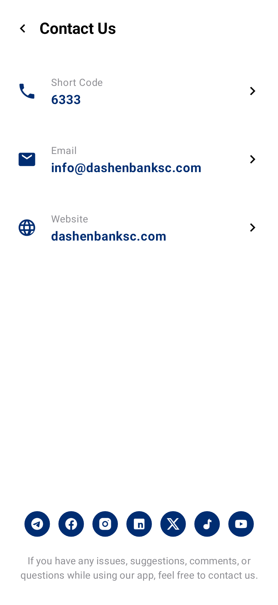
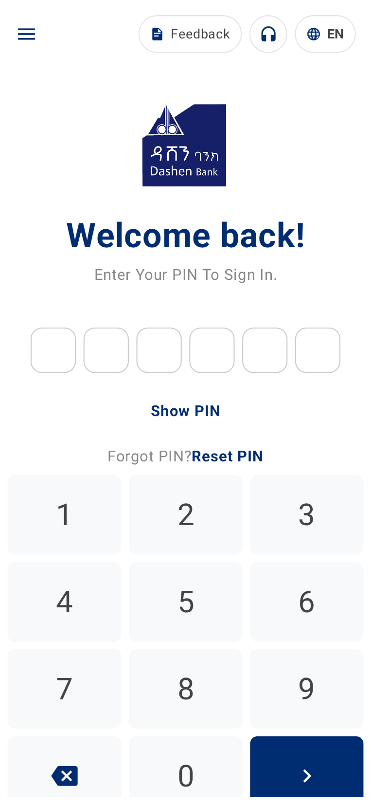
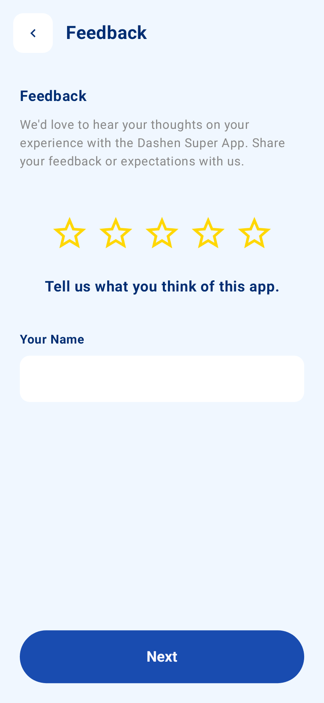

# Lab Manual: Android Development Fundamentals

## Learning Objectives

In this lab, you will explore the core pillars of Android development using Jetpack Compose:

1. **Persistence Memory:** Saving user data locally using `SharedPreferences`.
2. **Intents:** Interacting with other system applications (Dialer, Email, Browser).
3. **Navigation:** Managing screen transitions and state within a single-activity app.

---

## 1. Jetpack Compose Navigation

In our initial code base, there are screens already implemented. For example(look at /docs folder):





- In the provided codebase, three screens are already implemented:
    - `ContactUsScreen` → `Screen.kt`
    - `LoginScreen` → `MainScreen.kt`
    - `FeedbackScreen` → `FeedbackScreen.kt`

**📌 Currently:**
- The app only renders `LoginScreen`
- There is **no navigation system in place**

### Navigation in Compose

Before writing code, understand the architecture:

#### 🔹 NavController
- Acts as the navigation engine
- Maintains a back stack of screens
- Handles navigation actions (`navigate`, `popBackStack`)

#### 🔹 NavHost
- A **container** that displays the current screen
- Maps **routes → composables**

### Task: Setting up the `NavHost`

Reformat your `MainAppNavigation` to define the routes for your application.

```kotlin
@Composable  
fun MainAppNavigation() {  
    val navController = rememberNavController()  
    
    NavHost(
        navController = navController, 
        startDestination = "login"
    ) {  
        // Define the Login Screen Route
        composable("login") {  
            LoginScreen(  
                onFeedbackClick = { 
                    // Navigate to the feedback route when clicked
                    navController.navigate("feedback") 
                }  
            )  
        }  

        // Define the Feedback Screen Route
        composable("feedback") {  
            FeedbackScreen()  
        }  
    }
}
```

### 🔍 Checkpoint 1

At this stage:
- Clicking the feedback button → navigates to `FeedbackScreen`
- Pressing the **system back button** → returns to `LoginScreen`

Because `navigate()` **pushes** a new screen onto the stack.

### ⚠️ Problem: Incorrect Back Navigation

Inside `FeedbackScreen`, there is a **Back button**.

A naïve approach would be:

```kotlin
navController.navigate("login")
```

**🚫 This is incorrect.**

**Why?** This creates:
```
Login → Feedback → Login
```
You are **adding**, not returning.

---

### 🧠 Concept: Stack vs Navigation

| Action | Behavior |
|--------|----------|
| `navigate(route)` | Push new screen |
| `popBackStack()` | Remove current screen |

**👉 Good navigation is about stack discipline, not just movement.**

### ✅ Task 2: Fix Back Navigation

Update `FeedbackScreen` route:

```kotlin
composable("feedback") {    
    FeedbackScreen(    
        onBackClick = { navController.popBackStack() }    
    )    
}
```

---

### 🔍 Checkpoint 2

Now:
- Back button (UI or system) behaves consistently
- Stack returns to previous screen correctly

### ➡️ Task 3: Handle Forward Action

`FeedbackScreen` has a `Next` button with parameters:

```kotlin
onNextClick: (int, String) -> Unit
```

We are not using the data yet, so ignore parameters for now:

```kotlin
composable("feedback") {    
    FeedbackScreen(    
        onBackClick = { navController.popBackStack() },    
        onNextClick = { _, _ -> navController.popBackStack() }    
    )    
}
```

💡 This simulates "submit → return"

---

### 📞 Task 4: Add Contact Screen

Extend the navigation graph by adding:

```kotlin
composable("contact") {    
    ContactUsScreen(    
        onBackClick = { navController.popBackStack() }    
    )    
}
```

---

### 🔧 Task 5: Wire Navigation from Login

Inside `LoginScreen`, add:

```kotlin
onHeadphonesClick = {  
    navController.navigate("contact")  
}
```

### Task 6: Add a Bottom Drawer (Modal UI)

#### 🎯 Objective

#### Navigation vs UI State

Not everything in your app should be a navigation destination.

- **Navigation** → used for full-screen transitions (Login → Feedback)
- **UI State** → used for temporary overlays (dialogs, drawers, sheets)

**📌 A Bottom Drawer:**
- Does **not replace** the current screen
- It **overlays** on top of it
- Therefore, it should be controlled via **state**, not `NavController`

---

#### 🛠️ Step 1: Define UI State

Inside your `MainAppNavigation` (or a suitable parent composable), create state variables:

```kotlin
var showLanguageDrawer by remember { mutableStateOf(false) }    
var selectedLanguageCode by remember { mutableStateOf("en") }
```

**🔍 Explanation:**
- `showLanguageDrawer` → controls visibility (show/hide)
- `selectedLanguageCode` → stores the current selection

**👉 This is state-driven UI rendering**

---

#### 🛠️ Step 2: Trigger the Drawer from Login Screen

Update `LoginScreen` to expose an event:

```kotlin
onLanguageClick = { showLanguageDrawer = true }
```

**🔍 Behavior:**
- User taps language button
- State changes → `true`
- UI recomposes → drawer appears

---

#### 🛠️ Step 3: Render the Bottom Drawer

Place this **outside** the `NavHost`:

```kotlin
if (showLanguageDrawer) {    
    LanguageSelectorBottomSheet(    
        onDismissRequest = { showLanguageDrawer = false },    
        selectedLanguageCode = selectedLanguageCode,    
        onLanguageSelected = { code ->    
            selectedLanguageCode = code    
            showLanguageDrawer = false    
        }    
    )    
}
```

---

> **Important Design Note**
>
> Why outside `NavHost`?
> - `NavHost` is responsible for **screen-level UI**
> - The drawer is a **global overlay**
> - Placing it outside ensures it can appear on top of any screen

---

### 🔍 Checkpoint

At this stage:
- Clicking language button → opens drawer
- Selecting a language → updates state and closes drawer
- Dismissing → hides drawer without navigation

---

### Task 7: Conditional Navigation (Authentication Check)

#### Event vs Condition

So far:
- User clicks → navigation happens immediately
- No validation or decision-making

Now:
- User clicks → **logic runs first**
- Navigation happens **only if condition is satisfied**

**📌 This pattern is fundamental for:**
- Authentication
- Form validation
- Permissions

---

#### 🛠️ Step 1: Define State

Store the expected PIN:

```kotlin
var userPin by remember { mutableStateOf("123456") }
```

---

#### 🛠️ Step 2: Handle Sign-In Logic

Pass a handler to `LoginScreen`:

```kotlin
onSignInClick = { pin ->    
    if (pin == userPin) {    
        navController.navigate("dashboard")    
    }    
}
```

At the same time, add `dashboard` to Navigation Graph:

```kotlin
composable("dashboard") {  
    DashboardScreen()  
}
```

---

#### 🔍 Behavior

- User enters PIN
- Clicks Sign In
- System checks:
    - ✅ Match → navigate to `dashboard`
    - ❌ No match → stay on login screen

---

> **Missing Piece (Important)**
>
> Right now, failure does **nothing**. That's not good UX.

---

#### 🛠️ Step 3: Handle Invalid Input

Add feedback state:

```kotlin
var isError by remember { mutableStateOf(false) }
```

Update logic:

```kotlin
onSignInClick = { pin ->    
    if (pin == userPin) {    
        isError = false    
        navController.navigate("dashboard")    
    } else {    
        isError = true    
    }    
}
```

Pass `isError` to `LoginScreen` to show error UI.

---

#### Flow

```
User Action → Validation → Decision → Navigation
```

---

### Enhancement (Recommended)

#### 🔹 Prevent Back Navigation to Login

After successful login:

```kotlin
navController.navigate("dashboard") {  
    popUpTo("login") { inclusive = true }  
}
```

**🔍 Why?**
- Removes login screen from back stack
- Prevents user from returning using back button

### Task 8: Dynamic Start Destination & PIN Setup Flow

#### Conditional Start Destination

So far:
- App always starts at `"login"`

Now:
- App decides where to start based on **state**

```
No PIN → Go to setup    
Has PIN → Go to login
```

---

#### 🛠️ Step 1: Make PIN State Dynamic

Initialize `userPin` as empty:

```kotlin
var userPin by remember { mutableStateOf("") }
```

---

#### 🛠️ Step 2: Compute Start Destination

```kotlin
val startDestination = if (userPin.isEmpty()) "create_pin" else "login"
```

Apply it to your `NavHost`:

```kotlin
NavHost(  
    navController = navController,  
    startDestination = startDestination  
) {  
    // routes...  
}
```

---

#### ⚠️ Important Limitation

`startDestination` is evaluated **only once** when `NavHost` is first composed.

**👉 Changing `userPin` later will not automatically restart navigation**

That's why we manually navigate after PIN creation.

---

#### 🛠️ Step 3: Add PIN Creation Screen

```kotlin
composable("create_pin") {    
    PinSetupScreen(    
        isReset = false,    
        onPinCreated = { newPin ->    
            userPin = newPin    
            navController.navigate("login") {    
                popUpTo("create_pin") { inclusive = true }    
            }    
        }    
    )    
}
```

---

#### 🔍 Behavior

- App launches
    - `userPin == ""` → opens `create_pin`
- User creates PIN
- Navigates to login
- Setup screen is **removed from back stack**

---

#### 🔐 Step 4: Add PIN Reset Flow

Now handle the case where user wants to change their PIN.

```kotlin
composable("reset_pin") {    
    PinSetupScreen(    
        isReset = true,    
        onPinCreated = { newPin ->    
            userPin = newPin    
            navController.popBackStack()    
        }    
    )    
}
```

Also add reset button handler in `LoginScreen`:

```kotlin
OnResetPinClick = { navController.navigate("reset_pin") }
```

---

#### 🔍 Behavior

- User navigates to `reset_pin` (from somewhere like settings)
- Creates new PIN
- Returns to previous screen using `popBackStack()`

---

#### ⚠️ Subtle Difference

| Flow | Navigation Behavior |
|------|---------------------|
| Create PIN | `navigate + popUpTo` (clear setup) |
| Reset PIN | `popBackStack()` (return) |

**👉 This reflects different user intent**

> **Tip:** Always use `rememberNavController()` at the top level of your navigation hierarchy to ensure the state is preserved across recompositions.

---

## 2. Implicit Intents

**Intents** are messaging objects used to request an action from another app component. **Implicit Intents** do not name a specific component but instead declare a general action to perform.

### Task: Implementing Contact Actions

Inside `MainActivity.kt`, when rendering the `ContactUsScreen`, provide event handlers that trigger system actions.

```kotlin
val context = LocalContext.current
val shortCode = stringResource(id = R.string.short_code_value)  
val email = stringResource(id = R.string.email_value)  
val website = stringResource(id = R.string.website_value)

ContactUsScreen(
    onShortCodeClick = {  
        val intent = Intent(Intent.ACTION_DIAL, "tel:$shortCode".toUri())  
        context.startActivity(intent)  
    },  
    onEmailClick = {  
        val intent = Intent(Intent.ACTION_SENDTO, "mailto:$email".toUri())  
        context.startActivity(intent)  
    },  
    onWebsiteClick = {  
        // Ensure the URL is properly formatted for the browser
        val webUri = if (!website.startsWith("http")) "https://$website" else website
        val intent = Intent(Intent.ACTION_VIEW, webUri.toUri())  
        context.startActivity(intent)  
    }
)
```

---

## 3. Persistence Memory

Persistence allows your application to store data even after the app is closed. For simple key-value pairs like user preferences or login flags, we use **SharedPreferences**.

Persist user data locally so it survives:
- App restarts
- Process death
- Configuration changes

We use **SharedPreferences** for simple key-value storage (e.g., PIN, flags).

Until now:
- `remember { mutableStateOf(...) }` → ❌ volatile (lost on restart)

Now:
- `SharedPreferences` → ✅ persistent storage

```
UI State (RAM) ↔ Persistent Storage (Disk)
```

**👉 Your app must synchronize both layers.**

### Task: Create the PinManager

To handle PIN storage cleanly, we implement a `PinManager` class that follows a predefined interface. We encapsulate persistence logic inside a dedicated class.

> **📌 This is a Repository pattern (lightweight form)**

**📁 PinManager.kt**

```kotlin
class PinManager(context: Context) : PinInterface {  
    private val prefs: SharedPreferences = context.getSharedPreferences("pin_prefs", Context.MODE_PRIVATE)  
  
    override fun savePin(pin: String) {  
        // Uses the .edit { } extension for concise writing
        prefs.edit { putString("user_pin", pin) }  
    }  
  
    override fun getPin(): String {  
        return prefs.getString("user_pin", "") ?: ""  
    }  
  
    override fun isPinSet(): Boolean {  
        return getPin().isNotEmpty()  
    }  
}
```

### Why this design matters:

- UI does NOT directly touch storage
- Storage logic is centralized
- Easy to replace later (e.g., DataStore)

```
UI → PinManager → SharedPreferences
```

### Task: Integrating into UI State

Inside your `MainActivity.kt` (or within the `MainAppNavigation` composable), initialize the manager and sync it with your UI state.

```kotlin
val context = LocalContext.current
// Initialize the PinManager once
val pinManager = remember { PinManager(context) }

// Create a state variable initialized from persistent memory
var userPin by remember { mutableStateOf(pinManager.getPin()) }

// Example usage: Saving the pin when a user creates it
PinSetUpScreen(
    onPinCreated = { newPin ->  
        pinManager.savePin(newPin)
        userPin = newPin // Update state to reflect changes
    }
)
```

---

### ⚠️ Important Insight

This line:

```kotlin
var userPin by remember { mutableStateOf(pinManager.getPin()) }
```

means:
- UI state is initialized from persistent storage
- BUT it does NOT automatically stay in sync unless you update it manually

**👉 Always remember:**
> **Persistent storage is source of truth**  
> **UI state is a mirror**

If they diverge → bugs appear.

---

### ⚠️ Common Pitfall

If you only do this:

```kotlin
pinManager.savePin(newPin)
```

but forget:

```kotlin
userPin = newPin
```

**👉 UI will NOT immediately reflect changes.**

You now have a **3-layer architecture**:

```
UI Layer (Compose State)  
        ↓  
Domain Logic (PinManager)  
        ↓  
Persistence Layer (SharedPreferences)
```